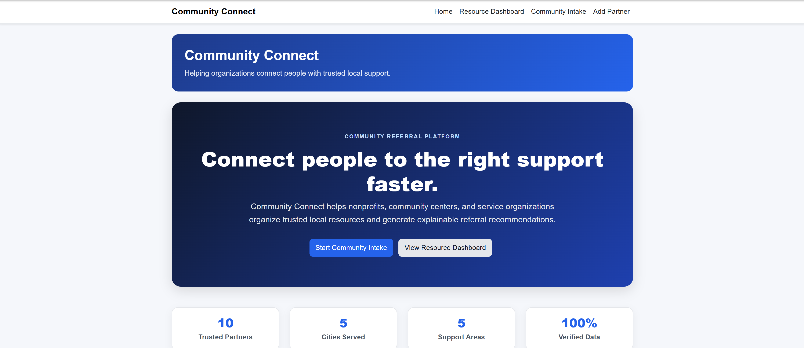
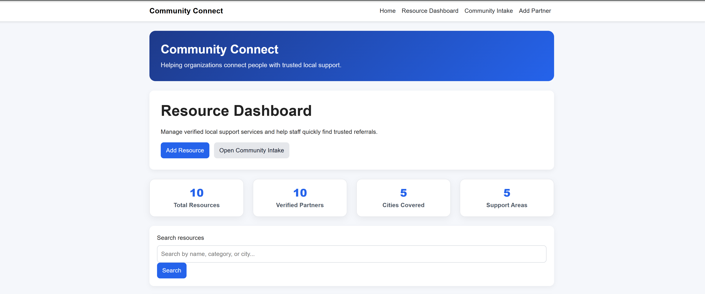
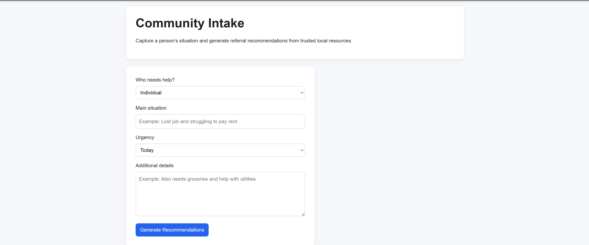
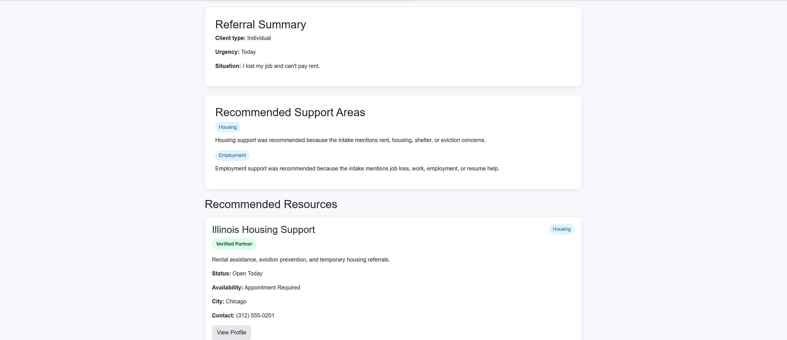
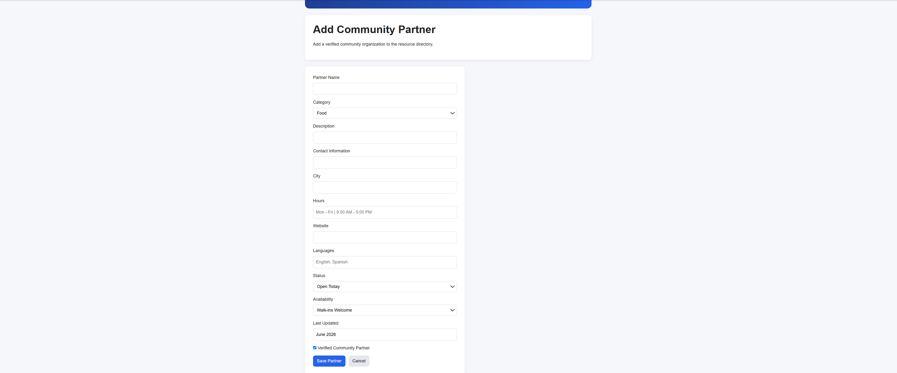

Community Connect is an AI-assisted ASP.NET Core MVC web application that helps volunteers and staff at community organizations connect clients with relevant support services.

Volunteers enter a client's situation using natural language. Google Gemini analyzes the intake and identifies the most relevant support categories. The application then searches its SQL Server database to return matching verified community resources. If the AI service is unavailable, Community Connect automatically falls back to a keyword-based recommendation engine to ensure recommendations remain available.

---

# 🎥 Project Demo

▶ **Watch the Demo**

https://youtu.be/wu-azJ6jPLE

---

# 📸 Application Preview

### Home Page



### Resource Dashboard



### Community Intake



### AI Referral Recommendations



### Community Partner Management



---

# Project Overview

Community Connect enables organizations to:

- Manage verified community resource providers
- Search available community services
- Maintain partner organizations
- Process volunteer client intake using natural language
- Identify appropriate support categories using AI
- Recommend verified community resources from a SQL Server database
- Maintain persistent referral information using Entity Framework Core

Unlike applications that rely solely on keyword matching, Community Connect combines AI-assisted classification with a structured SQL Server database, allowing volunteers to enter client situations naturally while maintaining control over which organizations are recommended.

---

# Key Features

- AI-Assisted Client Intake using Google Gemini
- Automatic Keyword-Based Fallback
- Community Resource Dashboard
- Community Partner Profiles
- Full CRUD Operations
- Search Resources by Name, Category and City
- SQL Server Database Integration
- Entity Framework Core
- Database Seeding
- Verified Community Resource Management
- Responsive Bootstrap User Interface

---

# AI Recommendation Workflow

Community Connect uses Google Gemini to understand volunteer-entered client intake notes.

The AI does **not** recommend organizations directly.

Instead, it identifies one or more relevant support categories:

- Food
- Housing
- Employment
- Healthcare
- Legal Aid

The application then searches its SQL Server database and returns matching verified community resources.

If the AI service is unavailable, the application automatically switches to its built-in keyword-based recommendation engine so volunteers can continue working without interruption.

---

# Technology Stack

## Backend

- C#
- ASP.NET Core MVC
- Entity Framework Core
- SQL Server LocalDB
- LINQ
- Google Gemini API

## Frontend

- Razor Views
- HTML5
- CSS3
- Bootstrap 5

## Development Tools

- Visual Studio 2022
- Git
- GitHub

---

# Architecture

```text
Volunteer
      │
      ▼
Community Intake
      │
      ▼
Google Gemini
      │
      ▼
Support Categories
      │
      ▼
ASP.NET Core MVC
      │
      ▼
Entity Framework Core
      │
      ▼
SQL Server
      │
      ▼
Verified Community Resources
```

---

# Database Features

- SQL Server LocalDB
- Entity Framework Core
- Code-First Development
- Database Migrations
- Database Seeding
- Persistent Data Storage
- Verified Resource Management

---

# Technical Skills Demonstrated

- ASP.NET Core MVC
- C#
- Entity Framework Core
- SQL Server
- Google Gemini API Integration
- Dependency Injection
- RESTful MVC Architecture
- CRUD Operations
- LINQ Queries
- Model Binding
- Routing
- Razor Views
- Bootstrap UI Development
- Database Design
- AI Integration
- Error Handling and Fallback Logic

---

# Future Improvements

- User Authentication & Authorization
- Role-Based Volunteer Access
- Azure SQL Database
- Azure App Service Deployment
- Advanced Search Filters
- Geographic Resource Search
- Analytics Dashboard
- Resource Availability Tracking
- Multi-language Client Intake

---

# About This Project

Community Connect was developed as a portfolio project to demonstrate practical full-stack development using the Microsoft .NET ecosystem together with modern AI integration.

The project combines ASP.NET Core MVC, Entity Framework Core, SQL Server, Bootstrap, and Google Gemini to create a volunteer-focused application that helps community organizations efficiently connect clients with trusted community resources.

Rather than allowing AI to recommend organizations directly, the application uses AI to classify client needs while ensuring every referral comes from the organization's verified database. This design improves consistency, transparency, and volunteer decision-making while maintaining control over recommended resources.

---

# Author

**Rahimeen Saleem**
